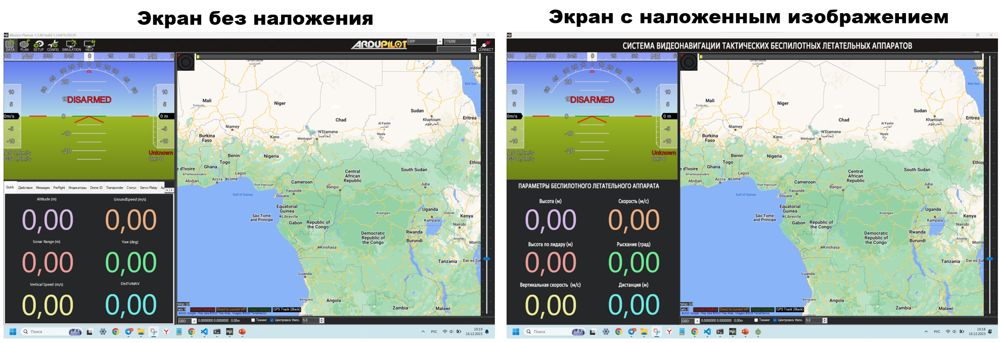

# Overlay image Windows
Маленький но полезный скрипт для наложения изображения поверх всех окон в Windows


## Установка зависимостей

Для работы скрипта необходимы следующие зависимости

```bash
  pip install pywin32
  pip install pygame 
```

## Запуск скрипта

Клонируй проект из репозитория 

```bash
  git clone https://github.com/vitaly1993/Overlay_image_windows.git
```

Перейди в дирректорию с проектом

```bash
  cd Overlay_image_windows
```

Запусти скрипт

```bash
  python test_overlay.py
```


## Пример результата работы скрипта


